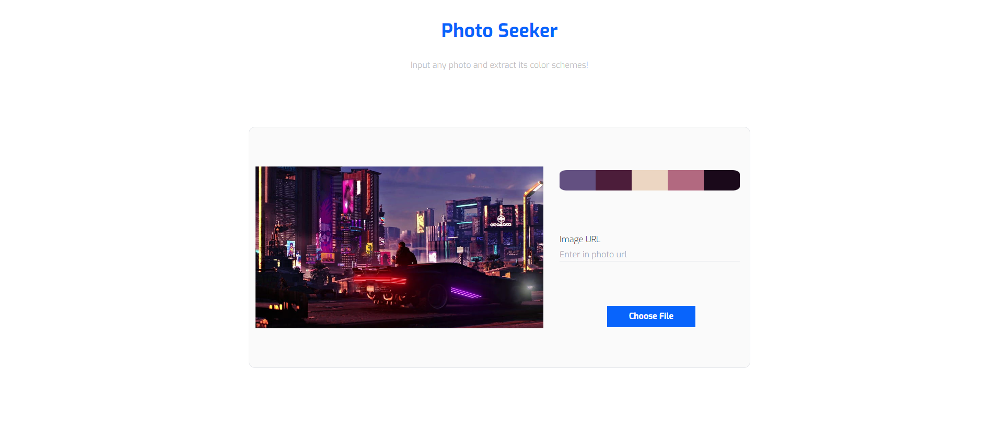

# Chroma-Blendr: Discover and create color palettes for any project

[!Chroma Blendr homepage](cb-home.png)

## Dynamically construct your very own color palette using the palette generator or extract color palettes from any images using color seeker

When building your own project, one of the hardest steps is picking your base themes such as the color scheme. Chroma-Blendr makes this process easier by helping you create a color palette that is appealing to you. 

## Prominant features in this app include

* generate palettes
* photo color palette extractor
* Sign in validation

## Tutorial

### Palette generator
Here you can craft your very own color palette

#### Main toolbar
* Sign in or sign up to get access to the utilities
* the main toolbar contains the save palette and view saves button
* save palette will save an entire palette and place it under the saved palletes section

#### Color tiles
Each color tile contains the following
* Save color button: copies the color to the saved pallete section
* Copy color button: copies the hex color to your clipboard
* Lock color button: Locks color preventing it from being changed. This can be toggled
* hex color and color name
To find the best palette for you, lock colors you like and continue to generate new color tiles until you find the perfect palette

#### Save tiles
This section is revealed upon sign in. It contains saved palettes and saved colors.
* Saved colors and palettes can be removed by pressing the undo or delete all buttons
* The hex colors of your saved colors can be copied to your clipboard by pressing the tile

### Photo color seeker
Here you can input any image and extract a five tile color palette

* Paste a URL or choose a file and view or copy the colors generated

## How to view this project

This project can be viewed on its own domain at <a href="chromablendr.com">

To view this project on your own local host

1. clone the project (prefferably on a text editor)
2. install node js
3. navigate to its main directory via terminal 'cd chroma-blendr'
4. run project with 'npm start'

## Tech stack

     

## This project displays skills in

* Form validation
* Prop drilling
* Responsive design using tailwind
* Color theory principles 
* Data management of large arrays
* Recursive algoritms

## packages used

* axios
* formik
* autoprefixer
* postcss
* kmeans-js
* react-router-v6
* react-spinners
* react-toastify
* react-icons

## known issues

* SaveTiles component lacks smooth transitioning while opening and closing
* Navigation to home page lacks loading screen
* When a hex color of a tile is less than 6 characters the api will render its name as black. 

